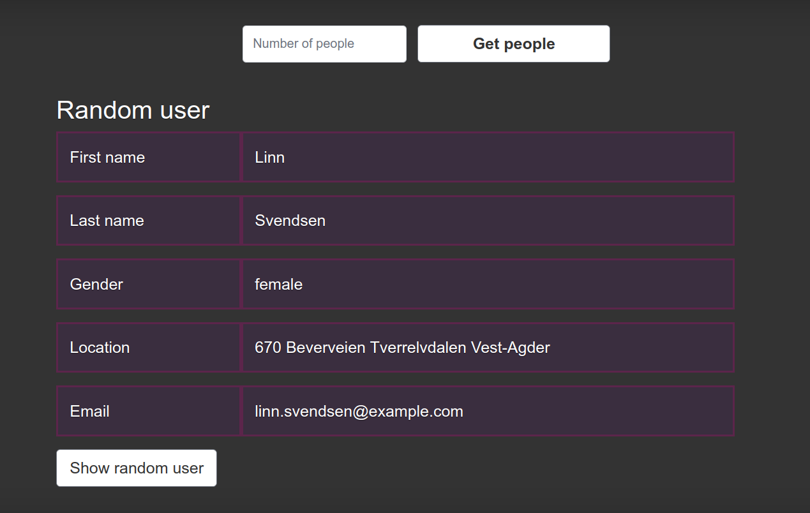

# Random user

This application uses ​https://randomuser.me/api/ for download information about random people.
You can set a number of people you want to download and up to 5 users will be saved to data base per one time.<br>
Application uses SQLAlchemy:SQLite for storage data about users.<br>
You can get information about random user from data base by pushing <br>
<b>Show Random User</b> button

## Installation

### Using Docker

Download the project via <b>Docker</b>: 
```
docker pull 11199722/flask_app
```
Run the server:
```
docker run -d -p 5000:5000 11199722/flask_app
```
Application will be available on your <b>localhost:5000</b>

### Using git
Clone the project:
```
git clone https://github.com/AlphaCaprice/random-user.git
```
Install requirements:
```
pip3 install -r requirements.txt --user
```
Run the application:
```
python flask_server/app.py
```
Application will be available on your <b>localhost:5000</b>
## Example
