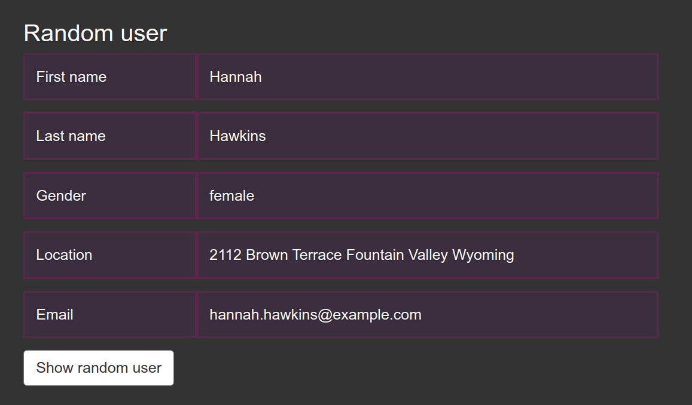

# Random user

This application uses ​https://randomuser.me/api/ for download information about random people. <br>
When server starts it automatically downloads random users while it won't be 5. Every query to home page will return new random user.  
Application uses SQLAlchemy:SQLite for storage data about users.<br>
You can get information about random user from data base by pushing <br>
<b>Show Random User</b> button

## Installation

### Using Docker

Download the project via <b>Docker</b>: 
```
docker pull 11199722/random_user_flask_app
```
Run the server:
```
docker run -d -p 5000:5000 11199722/random_user_flask_app
```
Application will be available on your <b>localhost:5000</b>

### Using git
Clone the project:
```
git clone https://github.com/AlphaCaprice/random-user.git
```
Create virtual environment and install requirements:
```
cd random-user
python3 -m venv venv
source venv/bin/activate
pip3 install -r requirements.txt
```
Run the application:
```
python flask_server/app.py
```
Application will be available on your <b>localhost:5000</b>
## Example
